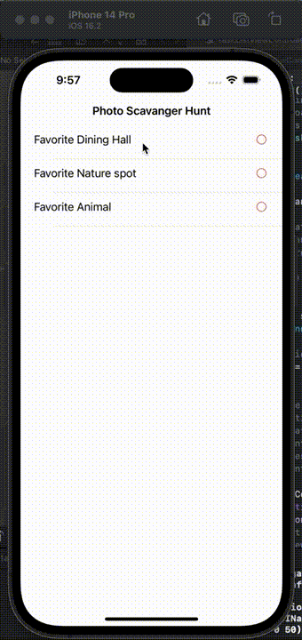

# Project 4 - Scavenge

Submitted by: Akhil Thata

Scavenge is an app that allows the user to input images into savenger hunt tasks and displays the image location data of the submitted image. Once this is done, the user can see the completed display

Time spent: **4** hours spent in total

## Required Features

The following **required** functionality is completed:

- [x] App displays list of hard-coded tasks
- [x] When a task is tapped it navigates the user to a task detail view
- [x] When user adds photo to complete the tasks, it marks the task as complete
- [x] When adding photo of task, the location is added
- [x] User returns to home page (list of tasks) and the status of your task is updated to complete
 
The following **optional** features are implemented:

- [ ] User can launch camera to snap a picture	

## Video Walkthrough

Here's a walkthrough of implemented user stories:

<!-- Replace this with whatever GIF tool you used! -->
GIF created with Record It and MP4 to GIF Converter  
<!-- Recommended tools:
[Kap](https://getkap.co/) for macOS
[ScreenToGif](https://www.screentogif.com/) for Windows
[peek](https://github.com/phw/peek) for Linux. -->

